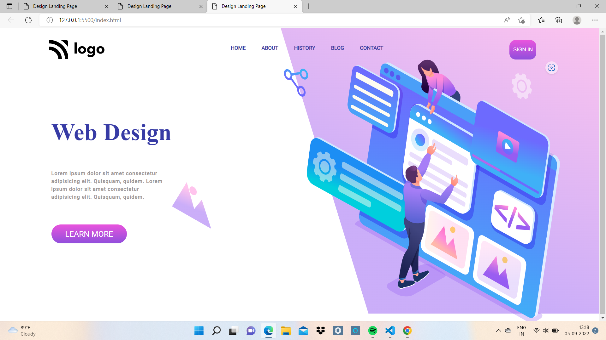
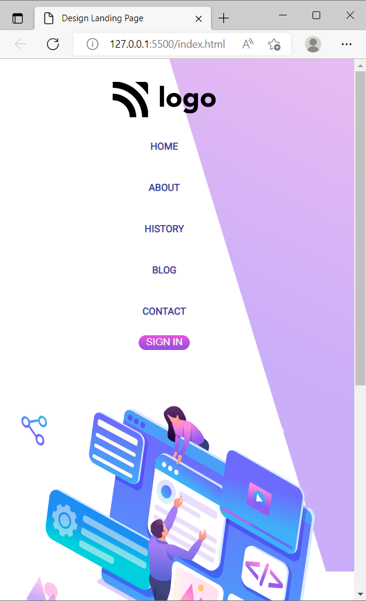
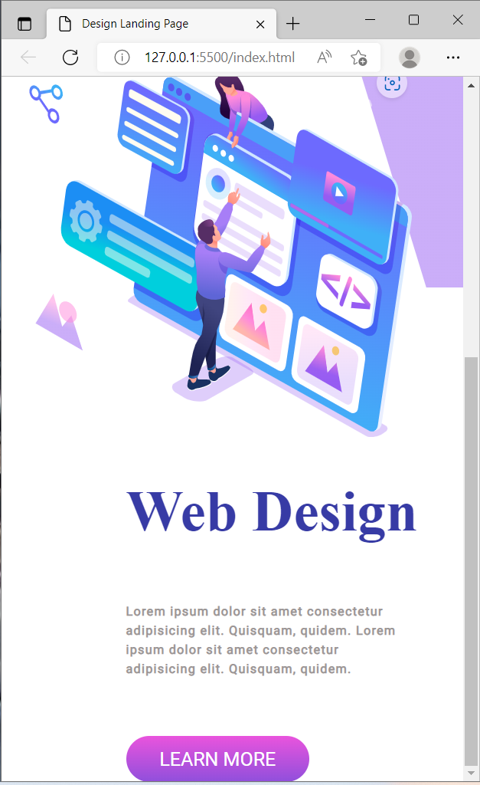

# Project Title : Design Landing Page

## About
 
 This project was to build a Mobile Responsive Design Landing Page, to divide the page into two sections and gradient colors to text and buttons.

 ## What Did I Learn From This Project

 I learnt to use linear gradient as background color to buttons and.

 ## Time Taken To Finish This Project

 Around 4 Hours.

 ## Screen Resolution

 1920 * 1200

 ## Project Final Look

 

 

 

